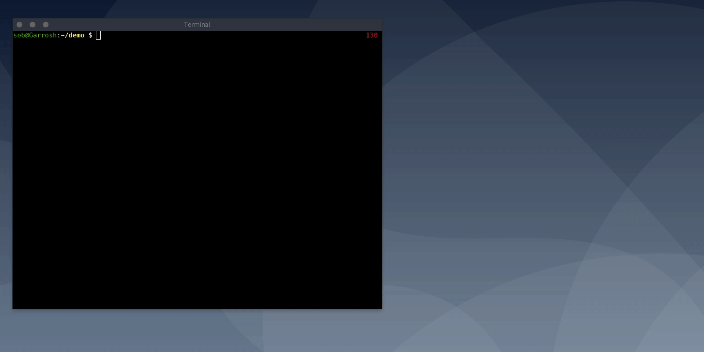
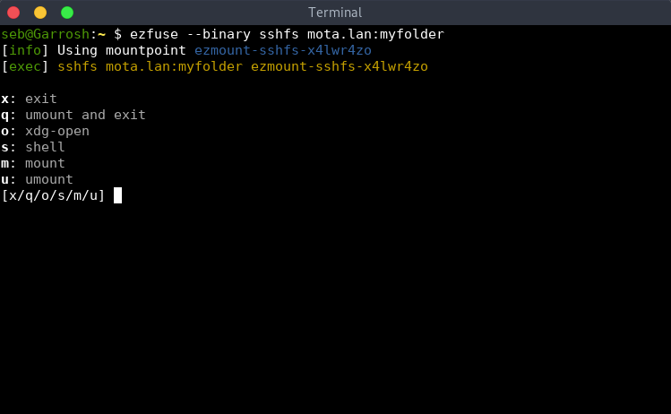

# EzFuse

EzFuse is a tool handle temporary mountpoints for *Fuse* filesystems.

Features:
- automatically create and remove a directory to mount the filesystem
- interactive shell dialog to execute actions
- you can mount, umount the mountpoint 
- you can open a shell in the mounted directory
- you can open your *file browser* in the mounted directory
- you can exit the *EzFuse*  and keep the mountpoint mounted




# Install

Install from [Pypi](https://pypi.org/project/ezfuse/)
```sh
$ pip3 install --user -U ezfuse
```

Or install latest version using pip and poetry
```sh
$ pip3 install --user -U poetry
$ pip3 install --user git+https://github.com/essembeh/ezfuse
```

Or setup a development environment
```sh
$ pip3 install --user -U poetry
$ git clone https://github.com/essembeh/ezfuse
$ cd ezfuse
$ poetry install
$ poetry shell
(.venv) $ ezfuse --version
```


# Usage

To mount a remote folder using `sshfs` ensure that `sshfs` is installed on your system before.

While the temporary directory is created, *EzFuse* is interactive and you are prompted for an action:
```sh
$ ezfuse --type sshfs MYREMOTEHOST:/some/path/here
[info] Using mountpoint ezmount-sshfs-9dy6yb34
[exec] sshfs MYREMOTEHOST:/some/path/here ezmount-sshfs-9dy6yb34

x: exit
q: umount and exit
o: xdg-open
s: shell
m: mount
u: umount
[x/q/o/s/m/u] 

```



When exiting *EzFuse* using `q`, the filesystem will automatically be unmounted and the temporary directory removed.

> Note: All executed commands are displayed with `[exec]` prefix.


# Advanced usage: use symlinks

By default, you have to pass the `-t, --type` to *EzFuse* to specify which *Fuse* filesystem to use, but you can also create symplinks to avoid that.

For example, to use `sshfs`, create a symlink named `ezsshfs` pointing to `ezfuse` 

```sh
$ mkdir -p ~/.local/bin/
$ ln -s $(which ezfuse) ~/.local/bin/ezsshfs
# Now the two commands are equivalent
$ ezsshfs MYREMOTEHOST:/some/path/here
$ ezfuse -t sshfs MYREMOTEHOST:/some/path/here
```

You can do it for every *Fuse* filesystem you may use, like `borgfs`for example:

```sh
$ ln -s $(which ezfuse) ~/.local/bin/ezborgfs
$ ezborgfs /path/to/my/backup.borg/
```

